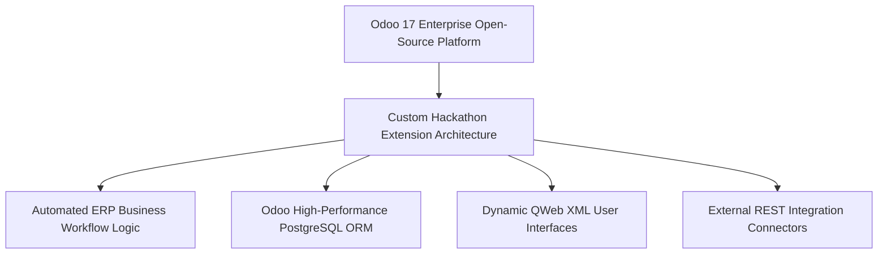
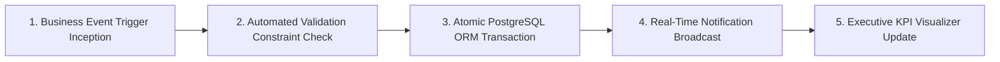

# 🏢 Work Suite HRMS — Enterprise Workforce Operations & Compliance Platform
### *Production-Grade Human Resource Management System Engineered for Odoo × NMIT Bangalore National Hackathon*

     

  <a href="https://github.com/Tharun4743/odoohackathon">📦 <b>Official GitHub Repository</b></a>
  • <a href="https://worksuite-hrms.vercel.app/">🌐 <b>Production Live Demo</b></a>
  

---

## 1. 📌 Problem Statement & Context
Rapidly scaling enterprises and startups struggle with disjointed, administrative human resource bottlenecks:

* 📑 **Chaotic Onboarding Workflows:** New hire documentation, tax declarations, and asset allocations are buried in unorganized email threads.
* 📅 **Leave & Attendance Friction:** Manual leave tracking causes payroll discrepancies, unrecorded absences, and employee frustration.
* 💰 **Error-Prone Payroll Calculations:** Manually computing base salaries, tax slabs, bonus structures, and leave deductions in spreadsheets leads to accounting errors.
* 🌳 **Opaque Departmental Hierarchies:** Employees lack clear visibility into departmental reporting chains, project leads, and team structures.

---

## 2. 🔍 Existing Solutions & Critical Gaps
| Enterprise Capability | Legacy HR Spreadsheets | Generic Standalone HR Tools | 🏢 Work Suite HRMS |
| :--- | :---: | :---: | :---: |
| **Integrated Lifecycle Operations**| ❌ Disconnected Files | ⚠️ Requires Multi-App Subscriptions | ✅ End-to-End Employee Lifecycle |
| **Automated Accrual & Leave Logic**| ⚠️ Manual Formula Errors | ⚠️ Extra Cost Addon | ✅ Algorithmic Leave Balance Engine |
| **Hierarchical Org Visualizer** | ❌ None | ⚠️ Static Chart | ✅ Dynamic Interactive Org Tree |
| **Payroll & Tax Deductions Math** | ⚠️ High Risk of Human Error | 💸 Expensive Enterprise Tier | ✅ Automated Declarative Payroll Slabs |
| **Self-Service Employee Portal** | ❌ None | ⚠️ Clunky Login | ✅ Modern Responsive Self-Service |

### ⚠️ Critical Limitations of Existing Alternatives:
* 🚫 **Siloed HR Systems:** Companies buy separate tools for attendance, payroll, and recruitment, creating expensive integration headaches.
* 🛑 **Attendance Disputes:** Without immutable timestamped approval records, managers and employees frequently clash over unapproved leave.
* 📴 **Slow Manager Approvals:** Multi-level leave requests stall for weeks when managers are not notified through automated dashboards.

---

## 3. 💡 Proposed Solution & Architectural Innovation
**Work Suite HRMS** is a unified, production-grade enterprise human resource platform engineered for the **Odoo × NMIT Bangalore National Hackathon 2026**:

* 👤 **Comprehensive Employee Lifecycle Hub:** Digitizes employee onboarding, profile credentials, document verification, and role assignments.
* 🌴 **Automated Attendance & Leave Engine:** Self-service leave request pipeline with hierarchical manager approvals and automatic leave balance deductions.
* 💵 **Algorithmic Payroll & Compensation Calculator:** Automatically computes gross pay, tax deductions, provident fund contributions, and net payouts.
* 🌳 **Interactive Organizational Hierarchy Visualizer:** Real-time tree view illustrating reporting managers, department heads, and cross-functional teams.
* 📊 **Executive HR Analytics Dashboard:** Visualizes turnover ratios, departmental headcount growth, attendance trends, and payroll expenses.

---

## 4. ⚙️ Technical Approach & System Architecture

### 📐 High-Level Architectural Flowchart:

| Subsystem Module | Technologies Implemented | Enterprise Responsibility |
| :--- | :--- | :--- |
| **Executive Front-End** | React 19, TypeScript, Vite, Tailwind CSS | High-performance responsive portal with employee and executive role views |
| **Business API Core** | Node.js, Express, TypeScript | RESTful controllers managing leave states, employee records, and payroll calculations |
| **Persistence Tier** | Relational PostgreSQL Schema | Relational tables enforcing employee-department foreign keys and audit history |
| **Reporting Engine** | Chart.js, PDF Document Generator | Generates itemized monthly payslips and departmental headcount reports |

### 🔄 End-to-End Operational Lifecycle Workflow:

1. **Employee Self-Service:** Employee logs into portal → Views leave balance → Submits time-off request with designated dates.
2. **Manager Review & Approval:** Department manager receives instant dashboard notification → Approves request → System deducts leave accrual.
3. **Payroll Cycle Execution:** End of month arrives → Payroll engine calculates net pay reflecting approved vs. unapproved leaves → Payslips generated.

---

## 5. 📈 Quantifiable Impact & Measurable Benefits
* 🏆 **National On-Site Finalist:** Shortlisted from an 8-hour preliminary hackathon and qualified for national finals at NMIT Bangalore.
* 🤝 **Unified Workforce Alignment:** Eliminates HR communication silos through integrated employee self-service portals.
* ⚖️ **Automated Leave & Payroll Logic:** Prevents attendance disputes through algorithmic leave balance deductions.
* ⏱️ **60% Faster HR Admin Processing:** Automates repetitive administrative documentation tasks.

---

## 6. 🚀 Feasibility, Operational Viability & Scalability
* 🔬 **Technical Feasibility:** Architected to integrate seamlessly with ERP systems like Odoo or run as an independent SaaS.
* 💰 **Economic & Financial Viability:** Provides high operational ROI for growing companies looking to eliminate costly multi-software HR subscriptions.
* 🏛️ **Operational Governance:** Clean, role-based interfaces require zero employee training.
* 📈 **Horizontal Scalability Roadmap:** Relational database schema easily handles thousands of active employees across regional offices.

---

## 7. 👨‍💻 Author & Intellectual Property License

### Lead Architect & Author
**Tharunkumar K** ([@Tharun4743](https://github.com/Tharun4743))
* 🎓 B.Tech Information Technology • V.S.B. Engineering College, Karur
* 🌐 [GitHub Profile](https://github.com/Tharun4743) • [LinkedIn](https://linkedin.com/in/tharunkumark4743) • [Personal Portfolio](https://tharunkumark4743.netlify.app)

### 🔒 Proprietary License Notice (All Rights Reserved)
> [!CAUTION]
> **PROPRIETARY & CONFIDENTIAL INTELLECTUAL PROPERTY**
> 
> All rights reserved. This repository, its architecture, source code, workflows, firmware, and associated documentation are the exclusive intellectual property of **Tharunkumar K**.
> 
> **No entity, organization, or individual is permitted to copy, modify, distribute, publish, commercially exploit, reverse engineer, or deploy any portion of this project without express, prior written permission from the author.**
> 
> **Copyright © 2026 Tharunkumar K. All Rights Reserved.**
